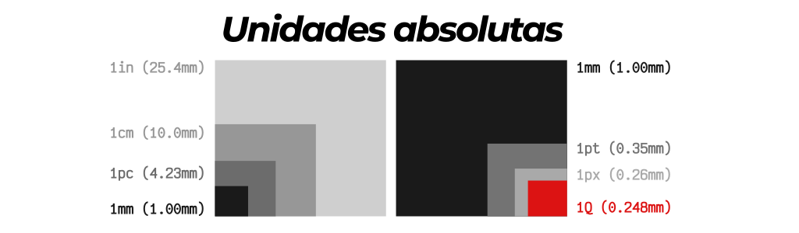
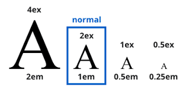
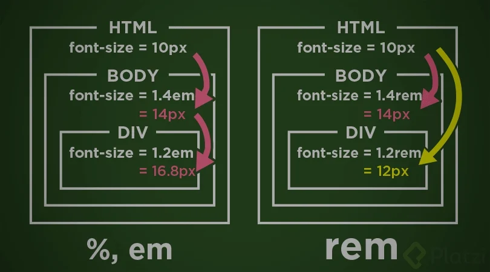

## Unidades Absolutas
Una medida indicada mediante unidades absolutas está completamente definida, ya que su valor no depende de otro valor de referencia. A continuación se muestra la lista completa de unidades absolutas definidas por CSS y su significado:

* in, pulgadas ("inches", en inglés). Una pulgada equivale a 2.54 centímetros.
* cm, centímetros.
* mm, milímetros.
* pt, puntos. Un punto equivale a 1 pulgada/72, es decir, unos 0.35 milímetros.
* pc, picas. Una pica equivale a 12 puntos, es decir, unos 4.23 milímetros.
* px, (píxel) respecto de la resolución de la pantalla del dispositivo en el que se visualiza la página HTML.

 Ctrl + click para ver la imagen

## Unidades Relativas
La unidades relativas, a diferencia de las absolutas, no están completamente definidas, ya que su valor siempre está referenciado respecto a otro valor. A pesar de su aparente dificultad, son las más utilizadas en el diseño web por la flexibilidad con la que se adaptan a los diferentes medios.

* em, (no confundir con la etiqueta <em> de HTML) relativa respecto del tamaño de letra del elemento.
* ex, relativa respecto de la altura de la letra x ("equis minúscula") del tipo y tamaño de letra del elemento.

Relaciones entre medidas  

## Otras unidades relativas

* "rem"  esta unidad requiere de una unidad anteriormente declarada, la hereda del padre de todos
Esta imagen lo deja clarisimo 

* "%" esta unidad depende del padre, width:100% ; es el ancho total del padre u contenedor siempre y cuando su display sea de algun tipo BLOCK

Aclaracion 100vh = 100% de la altura del navegador que utilizo
           100vw = 100% del ancho de mi navegador
           !NO TODOS TENEMOS EL MISMO MONITOR!

